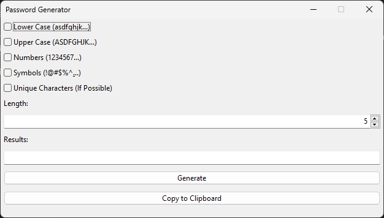

# Studi Kasus Python 3 Membuat Aplikasi Desktop Password Generator

-   [Studi Kasus Python 3 Membuat Aplikasi Desktop Password Generator](#studi-kasus-python-3-membuat-aplikasi-desktop-password-generator)
    -   [Source Code Project Ini](#source-code-project-ini)
    -   [Jika Ingin Mentraktir Saya](#jika-ingin-mentraktir-saya)
    -   [Cara Mencoba Kode Ini Tanpa Membaca Artikelnya Terlebih Dahulu](#cara-mencoba-kode-ini-tanpa-membaca-artikelnya-terlebih-dahulu)
    -   [Pendahuluan](#pendahuluan)
        -   [Latar Belakang](#latar-belakang)
        -   [Tujuan Studi Kasus](#tujuan-studi-kasus)
        -   [Prasyarat Studi Kasus](#prasyarat-studi-kasus)
        -   [Mengapa Saya Menggunakan wxPyhton](#mengapa-saya-menggunakan-wxpyhton)
    -   [Langkah-Langkah](#langkah-langkah)
        -   [Membuat folder project "password_generator"](#membuat-folder-project-password_generator)
        -   [Mengkopi file logo.ico ke "password_generator/logo.ico"](#mengkopi-file-logoico-ke-password_generatorlogoico)
        -   [Membuat file "password_generator/requirements.txt"](#membuat-file-password_generatorrequirementstxt)
        -   [Membuat file "password_generator/app.py"](#membuat-file-password_generatorapppy)
        -   [Membuat file "password_generator/PWDGen.py"](#membuat-file-password_generatorpwdgenpy)
        -   [Membuat file "password_generator/PWDGenDialog.py"](#membuat-file-password_generatorpwdgendialogpy)
        -   [Membuat file "password_generator/BaseDialog.py"](#membuat-file-password_generatorbasedialogpy)
        -   [Sebenarnya, "password_generator/BaseDialog.py" Dibuat Dengan Aplikasi Apa?](#sebenarnya-password_generatorbasedialogpy-dibuat-dengan-aplikasi-apa)
        -   [Pembuatan Struktur Project Selesai](#pembuatan-struktur-project-selesai)
    -   [Pembahasan](#pembahasan)
        -   [File "password_generator/logo.ico"](#file-password_generatorlogoico)
        -   [File "password_generator/requirements.txt"](#file-password_generatorrequirementstxt)
        -   [File "password_generator/app.py"](#file-password_generatorapppy)
        -   [File "password_generator/PWDGen.py"](#file-password_generatorpwdgenpy)
        -   [File "password_generator/PWDGenDialog.py" dan "password_generator/BaseDialog.py"](#file-password_generatorpwdgendialogpy-dan-password_generatorbasedialogpy)
    -   [Penutup](#penutup)

## Source Code Project Ini

Source code project ini ada di folder "password_generator".

## Jika Ingin Mentraktir Saya

Artikel ini gratis.

Jika Anda ingin mentraktir saya, kunjungi link saya:

https://taplink.cc/rakifsul

Di sana ada link untuk mentraktir saya dan link lainnya.

Selamat menikmati.

## Cara Mencoba Kode Ini Tanpa Membaca Artikelnya Terlebih Dahulu

Harus menggunakan Python 3.10.11.

Untuk menjalankan aplikasi ini, install Python3, masuk ke dalam folder "password_generator" via command line, lalu...

Buat virtual environment:

```
python -m venv venv
```

Untuk di windows agar venv bisa diaktifkan:

```
Set-ExecutionPolicy -ExecutionPolicy RemoteSigned -Scope CurrentUser
```

Aktifkan venv:

```
venv/Scripts/activate
```

Install dependencies:

```
pip install -r requirements.txt
```

Untuk menjalankannya dalam mode development:

```
python app.py
```

Untuk membuild exe DENGAN menyertakan console saat aplikasi dijalankan:

```
pyinstaller --onefile --icon=logo.ico app.py
```

Untuk membuild exe TANPA menyertakan console saat aplikasi dijalankan:

```
pyinstaller --onefile --noconsole --icon=logo.ico app.py
```

Lalu, Apa Itu GUI.fbp?

File GUI.fbp adalah template dari wxPython GUI yang dibuat dengan wxFormBuilder.

wxFormBuilder bisa di-download di:

https://github.com/wxFormBuilder/wxFormBuilder/releases

## Pendahuluan

### Latar Belakang

Dalam era digital yang semakin maju, keamanan data menjadi salah satu prioritas utama.

Salah satu langkah penting dalam menjaga keamanan data adalah penggunaan password yang kuat dan unik.

Password yang lemah atau mudah ditebak bisa menjadi celah keamanan yang dimanfaatkan oleh pihak tidak bertanggung jawab.

Oleh karena itu, sangat penting bagi pengguna untuk memiliki password yang kompleks dan sulit ditebak.

Namun, menciptakan password yang kuat dan berbeda untuk setiap akun bisa menjadi tugas yang menantang.

Banyak pengguna cenderung menggunakan password yang sama untuk beberapa akun atau memilih password yang mudah diingat tetapi mudah ditebak.

Untuk mengatasi masalah ini, aplikasi password generator dapat membantu pengguna dalam menciptakan password yang aman dan acak.

### Tujuan Studi Kasus

Tujuan dari studi kasus ini adalah untuk mengembangkan sebuah aplikasi password generator menggunakan Python 3 dan wxPython.

Aplikasi ini dirancang untuk menghasilkan password yang kuat dan acak dengan berbagai pilihan karakteristik, seperti panjang password dan jenis karakter yang digunakan (huruf besar, huruf kecil, angka, dan simbol).

Selain itu, aplikasi ini juga bisa menghasilkan password yang karakternya unik jika memungkinkan.

Aplikasi ini bekerja saat user memasukkan konfigurasi dari password yang akan digenerate.

Setelah prosedur generate password dijalankan, maka hasil password nya akan ditampilkan.

Dengan menggunakan wxPython sebagai framework untuk antarmuka pengguna, aplikasi ini diharapkan memiliki tampilan yang ramah pengguna.

Studi kasus ini juga bertujuan untuk memberikan panduan langkah demi langkah dalam pengembangan aplikasi.

### Prasyarat Studi Kasus

Berikut ini adalah prasyarat studi kasus ini:

-   Menggunakan Python 3.10.11. Sangat disarankan menggunakan versi yang sama, karena jika beda, kemungkinan wxPython tidak akan bekerja semestinya.
-   Menggunakan Windows 11. Ini karena saya hanya telah mengujinya di Windows 11.
-   Telah memahami dasar-dasar Python 3. Ini karena saya tidak akan menjelaskan dasar-dasar bahasa pemrogramannya.
-   Telah memahami penggunaan command line, terutama PowerShell.

### Mengapa Saya Menggunakan wxPyhton

wxPython adalah library untuk Python yang memungkinkan pembuatan aplikasi berbasis GUI (Graphical User Interface) yang kaya fitur dan berjalan di berbagai platform (cross-platform).

wxPython dibangun di atas wxWidgets, sebuah library C++ yang kuat untuk GUI.

Dengan wxPython, developer dapat membuat antarmuka pengguna yang menarik dan responsif tanpa harus menggunakan bahasa pemrograman lain selain Python.

Beberapa keunggulan wxPython meliputi:

-   Cross-Platform: wxPython mendukung berbagai sistem operasi sehingga aplikasi yang dibuat dapat berjalan di berbagai platform tanpa perubahan kode yang signifikan.
-   Komponen GUI yang Kaya: wxPython menyediakan berbagai macam widget dan kontrol yang dapat digunakan untuk membangun antarmuka pengguna yang kompleks, seperti tombol, kotak teks, menu, dan dialog.
-   Kemudahan Integrasi: wxPython mudah diintegrasikan dengan berbagai pustaka Python lainnya, memungkinkan pengembangan aplikasi yang lebih fleksibel dan kaya fitur.

Dengan menggunakan wxPython, aplikasi password generator yang akan dibangun dalam studi kasus ini tidak hanya akan memiliki logika penghasil password yang kuat, tetapi juga antarmuka pengguna yang intuitif dan mudah digunakan.

## Langkah-Langkah

### Membuat folder project "password_generator"

Hal pertama yang perlu Anda lakukan adalah membuat folder bernama "password_generator" di lokasi manapun di pc Windows 11 Anda, kemudian masuk ke dalamnya.

### Mengkopi file logo.ico ke "password_generator/logo.ico"

Carilah file icon berformat .ico dari suatu tempat atau gunakan yang telah disediakan di folder contoh project artikel ini, kemudian masukkan ke dalam folder "password_generator" milik Anda.

Pastikan nama file-nya adalah "logo.ico".

Sekarang, seharusnya Anda telah memiliki file "password_generator/logo.ico" di folder project Anda

### Membuat file "password_generator/requirements.txt"

Buatlah file "password_generator/requirements.txt" dan isi dengan kode ini:

```
altgraph==0.17.3
autopep8==2.0.0
certifi==2022.9.24
charset-normalizer==2.1.1
docopt==0.6.2
future==0.18.2
idna==3.4
numpy==1.23.4
pefile==2022.5.30
Pillow==9.3.0
pipreqs==0.4.11
pycodestyle==2.9.1
pyinstaller==5.6.2
pyinstaller-hooks-contrib==2022.12
pywin32-ctypes==0.2.0
requests==2.28.1
six==1.16.0
tomli==2.0.1
urllib3==1.26.12
wxPython==4.2.0
yarg==0.1.9
```

### Membuat file "password_generator/app.py"

Buatlah file "password_generator/app.py", kemudian isi dengan kode ini:

```
# import module.
import wx
from PWDGenDialog import PWDGenDialog

# buat objek aplikasi.
app = wx.App()

# buat dialog.
dialog = PWDGenDialog()

# tampilkan.
dialog.ShowModal()
```

### Membuat file "password_generator/PWDGen.py"

Buatlah file "password_generator/PWDGen.py", kemudian isi dengan kode ini:

```
import random

# class untuk meng-generate password.
class PWDGen:
    def __init__(self):
        # daftar karakter valid.
        self.lower_case_chars = "qwertyuiopasdfghjklzxcvbnm"
        self.upper_case_chars = "QWERTYUIOPASDFGHJKLZXCVBNM"
        self.numbers_chars = "1234567890"
        self.symbols_chars = "`~!@#$%^&*()-_=+[{]}|;:'\",<.>?"

        # status jenis karakter di awal program dijalankan.
        self.is_lower_case = False
        self.is_upper_case = False
        self.is_numbers = False
        self.is_symbols = False

        self.unique_chars = False
        self.length = 5
        pass

    def __del__(self):
        pass

    def generate_password(self):
        result = ""
        processed = ""
        possible_length = 0

        if self.is_upper_case == True:
            # Jika pilihan uppercase dicentang.
            processed += self.upper_case_chars
            possible_length += len(self.upper_case_chars)
        if self.is_lower_case == True:
            # Jika pilihan lowercase dicentang.
            processed += self.lower_case_chars
            possible_length += len(self.lower_case_chars)
        if self.is_numbers == True:
            # Jika pilihan numbers dicentang.
            processed += self.numbers_chars
            possible_length += len(self.numbers_chars)
        if self.is_symbols == True:
            # Jika pilihan symbols dicentang.
            processed += self.symbols_chars
            possible_length += len(self.symbols_chars)

        if processed == "":
            result = "nothing"
            return result

        if self.unique_chars == True:
            # Jika pilihan karakter unik dicentang.
            if self.length > possible_length:
                result = "not possible"
                return result

            arr_list = []

            for _ in range(self.length):
                elm = random.choice(processed)
                while elm in arr_list:
                    elm = random.choice(processed)
                arr_list.append(elm)

            result = ''.join(arr_list)
        else:
            # Jika pilihan karakter unik tidak dicentang.
            arr_list = []

            for _ in range(self.length):
                elm = random.choice(processed)
                arr_list.append(elm)

            result = ''.join(arr_list)

        return result

```

### Membuat file "password_generator/PWDGenDialog.py"

Buatlah file "password_generator/PWDGenDialog.py", kemudian isi dengan kode ini:

```
import wx
import webbrowser
from BaseDialog import BaseDialog
from PWDGen import PWDGen

# dialog utama, diturunkan dari BaseDialog.
class PWDGenDialog (BaseDialog):

    def __init__(self):
        BaseDialog.__init__(self, None)
        self.pwd_gen = PWDGen()

        # event binding.
        self.m_check_lower_case.Bind(wx.EVT_CHECKBOX, self.on_check_lower_case)
        self.m_check_upper_case.Bind(wx.EVT_CHECKBOX, self.on_check_upper_case)
        self.m_check_numbers.Bind(wx.EVT_CHECKBOX, self.on_check_numbers)
        self.m_check_symbols.Bind(wx.EVT_CHECKBOX, self.on_check_symbols)
        self.m_check_unique_characters.Bind(
            wx.EVT_CHECKBOX, self.on_check_unique_characters)

        self.m_button_generate.Bind(wx.EVT_BUTTON, self.on_button_generate)
        self.m_button_copy_to_clipboard.Bind(
            wx.EVT_BUTTON, self.on_button_copy_to_clipboard)

    def __del__(self):
        pass

    # saat lowercase dicentang/tidak dicentang.
    def on_check_lower_case(self, e):
        print("check " + str(e.IsChecked()))
        self.pwd_gen.is_lower_case = e.IsChecked()

    # saat uppercase dicentang/tidak dicentang.
    def on_check_upper_case(self, e):
        print("check " + str(e.IsChecked()))
        self.pwd_gen.is_upper_case = e.IsChecked()

    # saat numbers dicentang/tidak dicentang.
    def on_check_numbers(self, e):
        print("check " + str(e.IsChecked()))
        self.pwd_gen.is_numbers = e.IsChecked()

    # saat symbols dicentang/tidak dicentang.
    def on_check_symbols(self, e):
        print("check " + str(e.IsChecked()))
        self.pwd_gen.is_symbols = e.IsChecked()

    # saat unique characters dicentang/tidak dicentang.
    def on_check_unique_characters(self, e):
        print("check " + str(e.IsChecked()))
        self.pwd_gen.unique_chars = e.IsChecked()

    # saat tombol generate diklik.
    def on_button_generate(self, e):
        print("generate")
        self.pwd_gen.length = self.m_spin_ctrl_length.GetValue()
        result = self.pwd_gen.generate_password()
        self.m_text_ctrl_results.SetValue(result)

    # saat tombol copy to clipboard diklik.
    def on_button_copy_to_clipboard(self, e):
        print("copy")
        self.set_clipboard_text(self.m_text_ctrl_results.GetValue())
        pass

    # implementasi pengisian clipboard.
    def set_clipboard_text(self, value):
        text_data_object = wx.TextDataObject()
        text_data_object.SetText(value)
        if wx.TheClipboard.Open():
            wx.TheClipboard.SetData(text_data_object)
            wx.TheClipboard.Close()

```

### Membuat file "password_generator/BaseDialog.py"

Buatlah file "password_generator/BaseDialog.py", kemudian isi dengan:

```
# -*- coding: utf-8 -*-

###########################################################################
## Python code generated with wxFormBuilder (version 3.10.1-0-g8feb16b3)
## http://www.wxformbuilder.org/
##
## PLEASE DO *NOT* EDIT THIS FILE!
###########################################################################

import wx
import wx.xrc

###########################################################################
## Class BaseDialog
###########################################################################

class BaseDialog ( wx.Dialog ):

	def __init__( self, parent ):
		wx.Dialog.__init__ ( self, parent, id = wx.ID_ANY, title = u"Password Generator", pos = wx.DefaultPosition, size = wx.Size( 640,363 ), style = wx.CAPTION|wx.CLOSE_BOX|wx.MINIMIZE_BOX|wx.SYSTEM_MENU )

		self.SetSizeHints( wx.DefaultSize, wx.DefaultSize )

		m_b_sizer = wx.BoxSizer( wx.VERTICAL )

		self.m_check_lower_case = wx.CheckBox( self, wx.ID_ANY, u"Lower Case (asdfghjk...)", wx.DefaultPosition, wx.DefaultSize, 0 )
		m_b_sizer.Add( self.m_check_lower_case, 0, wx.ALL, 5 )

		self.m_check_upper_case = wx.CheckBox( self, wx.ID_ANY, u"Upper Case (ASDFGHJK...)", wx.DefaultPosition, wx.DefaultSize, 0 )
		m_b_sizer.Add( self.m_check_upper_case, 0, wx.ALL, 5 )

		self.m_check_numbers = wx.CheckBox( self, wx.ID_ANY, u"Numbers (1234567...)", wx.DefaultPosition, wx.DefaultSize, 0 )
		m_b_sizer.Add( self.m_check_numbers, 0, wx.ALL, 5 )

		self.m_check_symbols = wx.CheckBox( self, wx.ID_ANY, u"Symbols (!@#$%^&...)", wx.DefaultPosition, wx.DefaultSize, 0 )
		m_b_sizer.Add( self.m_check_symbols, 0, wx.ALL, 5 )

		self.m_check_unique_characters = wx.CheckBox( self, wx.ID_ANY, u"Unique Characters (If Possible)", wx.DefaultPosition, wx.DefaultSize, 0 )
		m_b_sizer.Add( self.m_check_unique_characters, 0, wx.ALL, 5 )

		self.m_static_text_length = wx.StaticText( self, wx.ID_ANY, u"Length:", wx.DefaultPosition, wx.DefaultSize, 0 )
		self.m_static_text_length.Wrap( -1 )

		m_b_sizer.Add( self.m_static_text_length, 0, wx.ALL, 5 )

		self.m_spin_ctrl_length = wx.SpinCtrl( self, wx.ID_ANY, wx.EmptyString, wx.DefaultPosition, wx.DefaultSize, wx.ALIGN_RIGHT|wx.SP_ARROW_KEYS, 1, 100000, 5 )
		self.m_spin_ctrl_length.SetMinSize( wx.Size( 9999,-1 ) )

		m_b_sizer.Add( self.m_spin_ctrl_length, 0, wx.ALL, 5 )

		self.m_static_text_results = wx.StaticText( self, wx.ID_ANY, u"Results:", wx.DefaultPosition, wx.DefaultSize, 0 )
		self.m_static_text_results.Wrap( -1 )

		m_b_sizer.Add( self.m_static_text_results, 0, wx.ALL, 5 )

		self.m_text_ctrl_results = wx.TextCtrl( self, wx.ID_ANY, wx.EmptyString, wx.DefaultPosition, wx.DefaultSize, 0 )
		self.m_text_ctrl_results.SetMinSize( wx.Size( 9999,-1 ) )

		m_b_sizer.Add( self.m_text_ctrl_results, 0, wx.ALL, 5 )

		self.m_button_generate = wx.Button( self, wx.ID_ANY, u"Generate", wx.DefaultPosition, wx.DefaultSize, 0 )
		self.m_button_generate.SetMinSize( wx.Size( 9999,-1 ) )

		m_b_sizer.Add( self.m_button_generate, 0, wx.ALL, 5 )

		self.m_button_copy_to_clipboard = wx.Button( self, wx.ID_ANY, u"Copy to Clipboard", wx.DefaultPosition, wx.DefaultSize, 0 )
		self.m_button_copy_to_clipboard.SetMinSize( wx.Size( 9999,-1 ) )

		m_b_sizer.Add( self.m_button_copy_to_clipboard, 0, wx.ALL, 5 )


		self.SetSizer( m_b_sizer )
		self.Layout()

		self.Centre( wx.BOTH )

	def __del__( self ):
		pass
```

### Sebenarnya, "password_generator/BaseDialog.py" Dibuat Dengan Aplikasi Apa?

Jika Anda perhatikan script "password_generator/BaseDialog.py", Anda mungkin akan menyadari bahwa kodenya seperti digenerate oleh aplikasi tertentu.

Memang benar, script tersebut digenerate oleh aplikasi wxFormBuilder yang bisa Anda download di:

https://github.com/wxFormBuilder/wxFormBuilder/releases

Namun, dalam langkah-langkah studi kasus ini, saya memilih untuk mengarahkan Anda mengkopi langsung hasilnya, karena itu tidak masalah dan lebih mudah.

Apabila Anda ingin mendasain GUI aplikasi ini dari awal, Anda bisa menggunakan wxFormBuilder dan menggenerate-nya, tapi jangan lupa menyesuaikan nama variabelnya dengan sisa script lainnya dan itu tidak dibahas dalam artikel ini.

Daripada begitu, jika Anda penasaran dengan wxFormBuilder, install saja, kemudian buka file "password_generator/gui.fbp" di folder project yang telah saya sediakan. File itu adalah desain GUI aplikasi ini yang sudah jadi dan bisa dibuka oleh wxFormBuilder.

### Pembuatan Struktur Project Selesai

Sekarang, Anda telah membangun struktur file dan folder project.

Langkah selanjutnya Adalah mencoba menjalankan dan mem-build executable aplikasi ini.

Sebenarnya di bagian ini, langkahnya sama dengan bagian "[Cara Mencoba Kode Ini Tanpa Membaca Artikelnya Terlebih Dahulu](#cara-mencoba-kode-ini-tanpa-membaca-artikelnya-terlebih-dahulu)".

Jadi, silakan baca bagian tersebut di bagian awal artikel ini, kemudian mulai dari perintah:

```
python -m venv venv
```

Dan seterusnya...

Untuk memastikan bahwa Anda berhasil, silakan cek screenshot aplikasi ini:



## Pembahasan

### File "password_generator/logo.ico"

Sebenarnya, jika Anda hanya ingin aplikasi ini berjalan, file icon tidak diperlukan.

Misalnya, Anda hanya ingin menguji aplikasi ini dengan menjalankan perintah command line.

Atau, Anda ingin menjalankan versi executable-nya dengan icon bawaan.

Perlu diketahui bahwa icon executable dari Windows memang menggunakan format .ico.

Mungkin di Linux atau Mac OS berbeda. Silakan tinjau kembali.

### File "password_generator/requirements.txt"

File "requirements.txt" adalah file teks berisi dependencies dari sebuah project Python 3.

```
altgraph==0.17.3
autopep8==2.0.0
certifi==2022.9.24
charset-normalizer==2.1.1
docopt==0.6.2
future==0.18.2
idna==3.4
numpy==1.23.4
pefile==2022.5.30
Pillow==9.3.0
pipreqs==0.4.11
pycodestyle==2.9.1
pyinstaller==5.6.2
pyinstaller-hooks-contrib==2022.12
pywin32-ctypes==0.2.0
requests==2.28.1
six==1.16.0
tomli==2.0.1
urllib3==1.26.12
wxPython==4.2.0
yarg==0.1.9
```

Isinya bisa berbeda-beda, tergantung apa yang dibutuhkan project.

Di dalamnya ada nama package diikuti versinya.

File ini bisa menjadi input dari perintah pip install.

```
pip install -r requirements.txt
```

Dengan menjalankan perintah tersebut, maka dependencies akan diinstall.

Jika Anda pernah belajar Node.js mungkin Anda bisa memahami mengapa saya bisa mengatakan bahwa requirements.txt analog dengan package.json.

### File "password_generator/app.py"

Kodenya adalah yang ini:

```
# import module.
import wx
from PWDGenDialog import PWDGenDialog

# buat objek aplikasi.
app = wx.App()

# buat dialog.
dialog = PWDGenDialog()

# tampilkan.
dialog.ShowModal()
```

Pertama, Baris ini:

```
import wx
```

Baris ini mengimpor modul wx, yang merupakan pustaka wxPython. wxPython adalah library untuk membuat aplikasi GUI dalam bahasa pemrograman Python.

Kedua, Baris ini:

```
from PWDGenDialog import PWDGenDialog:
```

Baris ini mengimpor kelas PWDGenDialog dari modul PWDGenDialog. PWDGenDialog mengimplementasikan dialog untuk aplikasi password generator.

Ketiga, Baris ini:

```
app = wx.App():
```

Baris ini membuat sebuah instance dari kelas wx.App. Objek wx.App diperlukan oleh setiap aplikasi wxPython karena bertanggung jawab untuk mengelola event loop dan inisialisasi sistem GUI.

Keempat, Baris ini:

```
dialog = PWDGenDialog():
```

Baris ini membuat sebuah instance dari kelas PWDGenDialog. Objek dialog ini mewakili dialog GUI yang akan ditampilkan. Kelas PWDGenDialog adalah subclass dari kelas BaseDialog (ada di BaseDialog.py) yang di-generate menggunakan wxFormBuilder.

Kelima, Baris ini:

```
dialog.ShowModal():
```

Baris ini menampilkan dialog sebagai modal dialog. Metode ShowModal() akan menampilkan dialog dan menghalangi window dibelakangnya sampai dialog tersebut ditutup. Ini biasanya digunakan untuk mendapatkan input dari pengguna sebelum melanjutkan proses lainnya.

### File "password_generator/PWDGen.py"

Kodenya adalah yang ini:

```
import random

# class untuk meng-generate password.
class PWDGen:
    def __init__(self):
        # daftar karakter valid.
        self.lower_case_chars = "qwertyuiopasdfghjklzxcvbnm"
        self.upper_case_chars = "QWERTYUIOPASDFGHJKLZXCVBNM"
        self.numbers_chars = "1234567890"
        self.symbols_chars = "`~!@#$%^&*()-_=+[{]}|;:'\",<.>?"

        # status jenis karakter di awal program dijalankan.
        self.is_lower_case = False
        self.is_upper_case = False
        self.is_numbers = False
        self.is_symbols = False

        self.unique_chars = False
        self.length = 5
        pass

    def __del__(self):
        pass

    def generate_password(self):
        result = ""
        processed = ""
        possible_length = 0

        if self.is_upper_case == True:
            # Jika pilihan uppercase dicentang.
            processed += self.upper_case_chars
            possible_length += len(self.upper_case_chars)
        if self.is_lower_case == True:
            # Jika pilihan lowercase dicentang.
            processed += self.lower_case_chars
            possible_length += len(self.lower_case_chars)
        if self.is_numbers == True:
            # Jika pilihan numbers dicentang.
            processed += self.numbers_chars
            possible_length += len(self.numbers_chars)
        if self.is_symbols == True:
            # Jika pilihan symbols dicentang.
            processed += self.symbols_chars
            possible_length += len(self.symbols_chars)

        if processed == "":
            result = "nothing"
            return result

        if self.unique_chars == True:
            # Jika pilihan karakter unik dicentang.
            if self.length > possible_length:
                result = "not possible"
                return result

            arr_list = []

            for _ in range(self.length):
                elm = random.choice(processed)
                while elm in arr_list:
                    elm = random.choice(processed)
                arr_list.append(elm)

            result = ''.join(arr_list)
        else:
            # Jika pilihan karakter unik tidak dicentang.
            arr_list = []

            for _ in range(self.length):
                elm = random.choice(processed)
                arr_list.append(elm)

            result = ''.join(arr_list)

        return result
```

Kelas PWDGen ini dirancang untuk menghasilkan password berdasarkan kriteria yang ditentukan oleh pengguna.

Pengguna dapat memilih untuk menyertakan huruf besar, huruf kecil, angka, dan simbol, serta menentukan apakah karakter dalam password harus unik.

Metode generate_password melakukan logika utama untuk membuat password sesuai dengan pengaturan yang telah ditetapkan.

Pertama, perlu dipahami bahwa karakter password yang memungkinkan ada dalam jangakuan ini:

```
        # daftar karakter valid.
        self.lower_case_chars = "qwertyuiopasdfghjklzxcvbnm"
        self.upper_case_chars = "QWERTYUIOPASDFGHJKLZXCVBNM"
        self.numbers_chars = "1234567890"
        self.symbols_chars = "`~!@#$%^&*()-_=+[{]}|;:'\",<.>?"
```

Jadi, tidak mungkin ada karakter selain itu saat password selesai di-generate.

Di awal program dijalankan, lower case, upper case, numbers, symbols, dan unique characters tidak dicentang. Selain itu panjangnya di-set 5 karakter:

```
        # status jenis karakter di awal program dijalankan.
        self.is_lower_case = False
        self.is_upper_case = False
        self.is_numbers = False
        self.is_symbols = False

        self.unique_chars = False
        self.length = 5
```

Pada saat tombol generate diklik, instruksi yang ada di method def generate_password(self) akan dijalankan.

### File "password_generator/PWDGenDialog.py" dan "password_generator/BaseDialog.py"

PWDGenDialog adalah subclass dari BaseDialog (yang digenerate oleh wxFormBuilder) yang tidak mengubah tampilan dari parent class-nya.

Jadi, tidak ada perubahan tampilan, hanya fungsinya saja.

```
# dialog utama, diturunkan dari BaseDialog.
class PWDGenDialog (BaseDialog):
```

Saat diinisialisasi, PWDGenDialog melakukan event binding terhadap semua checkbox dan button.

```
 def __init__(self):
        BaseDialog.__init__(self, None)
        self.pwd_gen = PWDGen()

        # event binding.
        self.m_check_lower_case.Bind(wx.EVT_CHECKBOX, self.on_check_lower_case)
        self.m_check_upper_case.Bind(wx.EVT_CHECKBOX, self.on_check_upper_case)
        self.m_check_numbers.Bind(wx.EVT_CHECKBOX, self.on_check_numbers)
        self.m_check_symbols.Bind(wx.EVT_CHECKBOX, self.on_check_symbols)
        self.m_check_unique_characters.Bind(
            wx.EVT_CHECKBOX, self.on_check_unique_characters)

        self.m_button_generate.Bind(wx.EVT_BUTTON, self.on_button_generate)
        self.m_button_copy_to_clipboard.Bind(
            wx.EVT_BUTTON, self.on_button_copy_to_clipboard)
```

Handler dari event-event tersebut ada di sini:

```
# saat lowercase dicentang/tidak dicentang.
    def on_check_lower_case(self, e):
        print("check " + str(e.IsChecked()))
        self.pwd_gen.is_lower_case = e.IsChecked()

    # saat uppercase dicentang/tidak dicentang.
    def on_check_upper_case(self, e):
        print("check " + str(e.IsChecked()))
        self.pwd_gen.is_upper_case = e.IsChecked()

    # saat numbers dicentang/tidak dicentang.
    def on_check_numbers(self, e):
        print("check " + str(e.IsChecked()))
        self.pwd_gen.is_numbers = e.IsChecked()

    # saat symbols dicentang/tidak dicentang.
    def on_check_symbols(self, e):
        print("check " + str(e.IsChecked()))
        self.pwd_gen.is_symbols = e.IsChecked()

    # saat unique characters dicentang/tidak dicentang.
    def on_check_unique_characters(self, e):
        print("check " + str(e.IsChecked()))
        self.pwd_gen.unique_chars = e.IsChecked()

    # saat tombol generate diklik.
    def on_button_generate(self, e):
        print("generate")
        self.pwd_gen.length = self.m_spin_ctrl_length.GetValue()
        result = self.pwd_gen.generate_password()
        self.m_text_ctrl_results.SetValue(result)

    # saat tombol copy to clipboard diklik.
    def on_button_copy_to_clipboard(self, e):
        print("copy")
        self.set_clipboard_text(self.m_text_ctrl_results.GetValue())
        pass
```

Salah satu button tugasnya mengkopi teks ke clipboard, begini cara melakukannya:

```
# implementasi pengisian clipboard.
    def set_clipboard_text(self, value):
        text_data_object = wx.TextDataObject()
        text_data_object.SetText(value)
        if wx.TheClipboard.Open():
            wx.TheClipboard.SetData(text_data_object)
            wx.TheClipboard.Close()
```

## Penutup

Sekarang, saya sudah membahas semua file project password generator di repository ini.

Walaupun aplikasi ini sederhana, ternyata pembahasannya cukup panjang.

Itulah mengapa saya sangat menganjurkan Anda untuk membiasakan diri membaca dan memahami kode, bahkan yang tidak ada komentarnya sama sekali.

Selanjutnya, giliran Anda untuk mengutak-atik kode ini dan melihat hasilnya.
